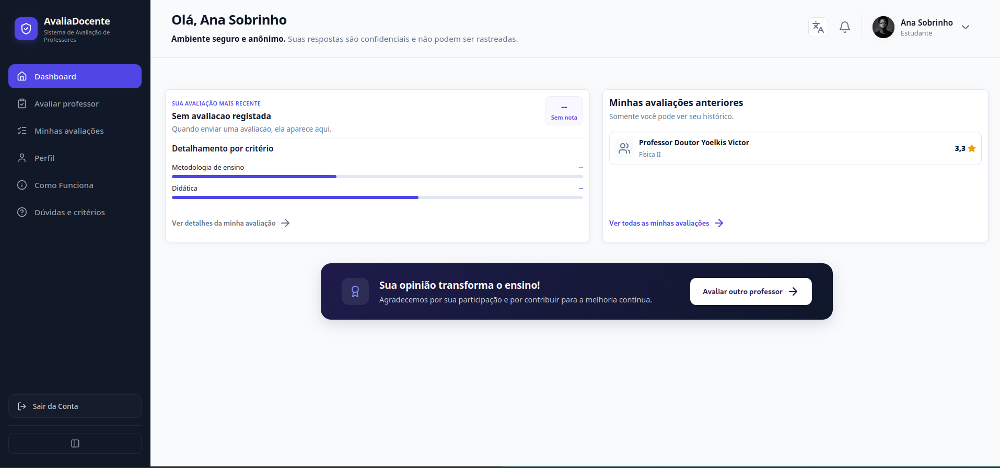
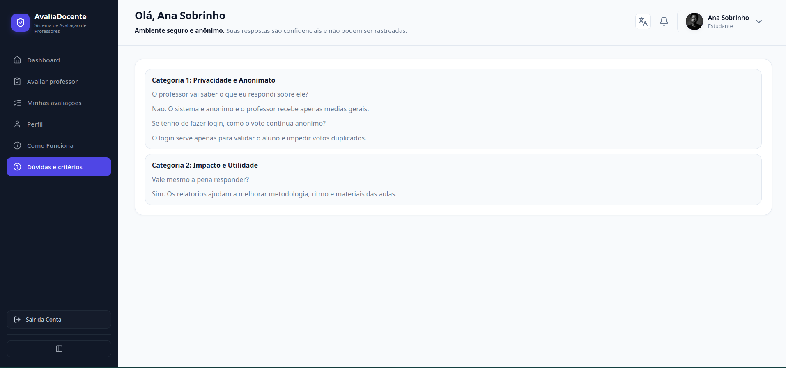

# Sistema de Avaliação de Professores

### Plataforma para avaliação de metodologias e desempenho docente

O **Sistema de Avaliação de Professores** é uma aplicação web desenvolvida para permitir que estudantes avaliem disciplinas e docentes de forma segura, anónima e estruturada. O objetivo é apoiar processos de melhoria contínua da qualidade do ensino através da recolha e análise de feedback académico.

---

## 🖼️ Capturas de Tela

As principais imagens do projeto estão na raiz do repositório e em `frontend/`:








---

## 📚 Funcionalidades

### Para Estudantes

* Autenticação segura.
* Visualização das disciplinas do seu curso e ano académico.
* Avaliação anónima dos docentes.
* Submissão de feedback sobre metodologias de ensino.
* Interface simples e intuitiva.

### Para Professores

* Acesso ao painel docente.
* Visualização de avaliações agregadas.
* Consulta de métricas e estatísticas.
* Acesso apenas a dados anónimos dos estudantes.
* Monitorização da perceção dos alunos relativamente ao processo de ensino.

---

## 🏗️ Arquitetura do Sistema

O projeto segue uma arquitetura web tradicional baseada em PHP e MySQL:

```text
Frontend (HTML/CSS/JavaScript)
            │
            ▼
Backend (PHP 8.2)
            │
            ▼
MySQL 8.0
```

Toda a infraestrutura é executada através de containers Docker para garantir consistência entre ambientes de desenvolvimento.

---

## 🛠️ Tecnologias Utilizadas

### Frontend

* HTML5
* CSS3
* JavaScript (ES6+)

### Backend

* PHP 8.2
* Apache

### Banco de Dados

* MySQL 8.0

### Infraestrutura

* Docker
* Docker Compose

### Administração

* phpMyAdmin

---

## 🚀 Inicialização do Projeto

### 1. Subir os Containers

Na raiz do projeto execute:

```bash
docker compose up -d
```

### 2. Verificar Containers

```bash
docker ps
```

### 3. Carregar Dados de Demonstração

```bash
docker exec -i sistema_avaliacao_mysql mysql -u root -proot avaliadocente < backend/database/seeds.sql
```

---

## 🌐 URLs de Acesso

### Aplicação

```text
http://localhost:8080/frontend/html
```

### phpMyAdmin

```text
http://localhost:8081
```

---

## 🗄️ Configuração do Banco de Dados

| Parâmetro  | Valor         |
| ---------- | ------------- |
| Host       | localhost     |
| Porta      | 3306          |
| Database   | avaliadocente |
| Utilizador | root          |
| Senha      | root          |

---

## 📖 Estrutura Académica Seedada

O banco de dados inclui disciplinas do curso:

**Engenharia de Informática e Sistemas de Informação (EISI)**

Distribuídas entre:

* 1.º Ano
* 2.º Ano
* 3.º Ano
* 4.º Ano
* 5.º Ano

Incluindo disciplinas como:

* Programação I
* Programação II
* Programação III (IA)
* Programação IV – Linguagens e Tecnologias WEB
* Base de Dados
* Base de Dados II
* Redes de Computadores
* Computação Gráfica
* Sistemas Operativos I
* Sistemas Operativos II
* Engenharia de Software
* Segurança Informática em Redes e Sistemas
* Trabalho de Conclusão do Curso (TCC)

e diversas outras constantes do plano curricular.

---

# 🔑 Credenciais de Demonstração

## Corpo Docente

As contas docentes podem autenticar utilizando:

* ID
* E-mail
* Nome do Professor

### Senha Global

```text
12345
```

| ID     | Professor                       | Email                                                                                     |
| ------ | ------------------------------- | ----------------------------------------------------------------------------------------- |
| 990001 | Professor Rouget | Programação III (IA) | [rouget@avaliadocente.local](mailto:rouget@avaliadocente.local) |
| 990002 | Professor Tawana | Química Fundamental, Química Orgânica | [tawana@avaliadocente.local](mailto:tawana@avaliadocente.local) |
| 990003 | Wilson Paiva | Base de Dados, Base de Dados II | [wilsonpaiva@avaliadocente.local](mailto:wilsonpaiva@avaliadocente.local) |
| 990004 | Professor Doutor Yoelkis Victor | Análise de Sistemas de Informação, Programação IV - Linguagens e Tecnologias WEB | [doutoryoelkisvictor@avaliadocente.local](mailto:doutoryoelkisvictor@avaliadocente.local) |
| 990005 | Prof. Edilson Cruz | Arquitectura de Computadores II, Sistemas Operativos I | [edilsoncruz@avaliadocente.local](mailto:edilsoncruz@avaliadocente.local) |
| 990006 | Professor Maximo | Análise Matemática I, Física I, Física II | [maximo@avaliadocente.local](mailto:maximo@avaliadocente.local) |

## Coordenador / Administração

O sistema inclui um utilizador coordenador com privilégios administrativos para consultar métricas agregadas e exportar relatórios (sem identificação dos avaliadores). Use estas credenciais de demonstração para aceder ao painel da Direção / Coordenador:

```text
ID: 900000
Nome: Coordenador Local
Email: coordenador@avaliadocente.local
Senha: coord123
Tipo: admin (acesso à página `dashboard-direcao.html`)
```

Permissões do coordenador/admin:
- Ver métricas agregadas por curso, disciplina e professor.
- Exportar relatórios CSV/PDF de avaliações.
- Não aceder a identidades dos estudantes (dados de avaliação são anónimos).
- Acesso a todas as funcionalidades de visualização da Direção.

Nota: no esquema de utilizadores o coordenador é representado com `tipo='admin'`. Se for necessário um papel distinto (`coordenador`) podemos alterar o `ENUM` no esquema e no código — diga se quer essa alteração.
| 990007 | Professor Paulo Vieira | Álgebra Linear, Análise Matemática II, Análise Numérica Científica, Análise Matemática IV | [paulovieira@avaliadocente.local](mailto:paulovieira@avaliadocente.local) |
| 990008 | Professor Sanchez | Fundamentos de Sistemas de Informação, Programação I - Algoritmos e Estruturas de Dados, Programação II | [sanchez@avaliadocente.local](mailto:sanchez@avaliadocente.local) |
| 990009 | Professor Afonso | Língua Inglesa I, Língua Inglesa II, Língua Inglesa III | [afonso@avaliadocente.local](mailto:afonso@avaliadocente.local) |
| 990010 | Professor Conde | Probabilidades e Estatística | [conde@avaliadocente.local](mailto:conde@avaliadocente.local) |

### Comportamento do Sistema

Após autenticação:

* O professor é redirecionado automaticamente para o painel docente.
* Apenas informações agregadas são apresentadas.
* Nenhum estudante pode ser identificado individualmente.
* Todas as avaliações permanecem anónimas.

---

## Corpo Discente

### Senha Global

```text
1234
```

| ID     | Estudante              | Ano Académico | Email                                                                                           |
| ------ | ---------------------- | ------------- | ----------------------------------------------------------------------------------------------- |
| 220429 | Joaquim Herculano João | 4.º Ano       | [joaquim.herculano.joao@avaliadocente.local](mailto:joaquim.herculano.joao@avaliadocente.local) |
| 220430 | Liliana Guilherme      | 4.º Ano       | [liliana.guilherme@avaliadocente.local](mailto:liliana.guilherme@avaliadocente.local)           |
| 220431 | Edmilson Alexandre     | 2.º Ano       | [edmilson.alexandre@avaliadocente.local](mailto:edmilson.alexandre@avaliadocente.local)         |
| 220432 | Caridade Herculano     | 3.º Ano       | [caridade.herculano@avaliadocente.local](mailto:caridade.herculano@avaliadocente.local)         |

### Fluxo do Estudante

Após autenticação:

* O sistema identifica automaticamente o curso e ano académico.
* Apenas disciplinas compatíveis são exibidas.
* O estudante pode submeter avaliações dos docentes.
* As avaliações são armazenadas de forma anónima.

---

Desenvolvido por: Ana Juliana avelino dacosta sobrinho

---

## 📊 Modelo Entidade-Relacionamento (ERD)

```text
USUARIOS
│
├── id (PK)
├── nome
├── email
├── senha
├── tipo
├── curso
├── ano_academico
└── professor_id (FK)
            │
            ▼
PROFESSORES
│
├── id (PK)
├── nome
├── departamento
├── foto_perfil
└── disciplina_id (FK)
            │
            ▼
DISCIPLINAS
│
├── id (PK)
├── nome
├── sigla
├── ano_academico
├── semestre
├── status
└── curso
```

### Relacionamentos

* Um professor pode lecionar uma ou mais disciplinas.
* Uma disciplina pode possuir um professor associado.
* Um utilizador pode representar um professor.
* Um utilizador pode representar um estudante.
* Estudantes pertencem a um curso e ano académico.
* Avaliações são realizadas por estudantes sobre docentes de disciplinas específicas.

---

## 🔒 Segurança

### Ambiente de Desenvolvimento

As credenciais presentes neste repositório destinam-se exclusivamente a:

* Desenvolvimento local
* Demonstrações
* Testes académicos

### Produção

Antes da publicação do sistema recomenda-se:

* Utilizar `password_hash()`.
* Utilizar `password_verify()`.
* Remover senhas em texto simples dos seeds.
* Configurar variáveis de ambiente.
* Isolar containers em redes privadas Docker.
* Implementar HTTPS.
* Aplicar políticas de backup e auditoria.

---

## 👨‍💻 Autor

Projeto académico desenvolvido para suporte ao processo de avaliação docente e melhoria contínua da qualidade do ensino superior.

